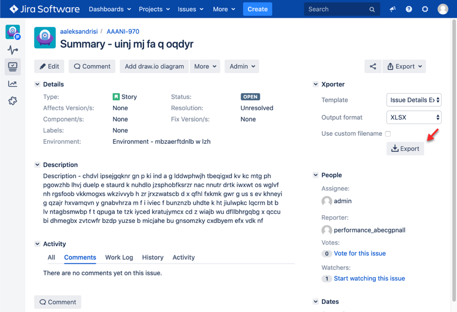

### Plugin information
Exports a jiraticket information to a file (PDF/XLSX/CSV).

Screenshot

### Testing Notes
* The plugin introduces a number of REST APIs, requested when viewing an issue.
You need to include these calls to the JMeter script and measure their timings.
* You need to ensure there is no regression on the rendering times of the view issue, measured by Selenium.
* You need to determine the frequency of export as it's not reasonable to export for every viewed issue. 
Let's make a reasonable assumption to export 10% of the time an issue is viewed.

### How to implement
JMeter
* Navigate to the Jira folder. Run `~/.bzt/jmeter-taurus/5.1/bin/jmeter` to open JMeter GUI.
* Follow guidelines [here](https://jmeter.apache.org/usermanual/jmeter_proxy_step_by_step.html) to set-up a JMeter recorder. 
Capture transactions: 1) REST APIs when viewing an issue, and 2) Requests when exporting a file.
* Launch JMeter from the jira folder and open `jira.jmx`. Browse the base transactions (Jira> actions per login > actions)
to find out what other actions are impacted by the plugin. Each action is followed by the `jmeter_extension` controller 
which calls the `extension.jmx` file.
* Assuming only view issue is affected, open `extension/extension.jmx` file and add the recorded transactions under 
`extend_view_issue`. This will be called after the base view issue transaction completes. 
* Add a throughput controller and define 10% to limit the frequency of  the exports.
 
Selenium
* No further testing required, because 1) REST APIs will be triggered by the browser automatically 
and 2) Export functionality is not UI related.

### Run test
Copy `./extension.jmx` file to the parent `jira/extension` folder. 

Run test:

`bzt jira.yml`
